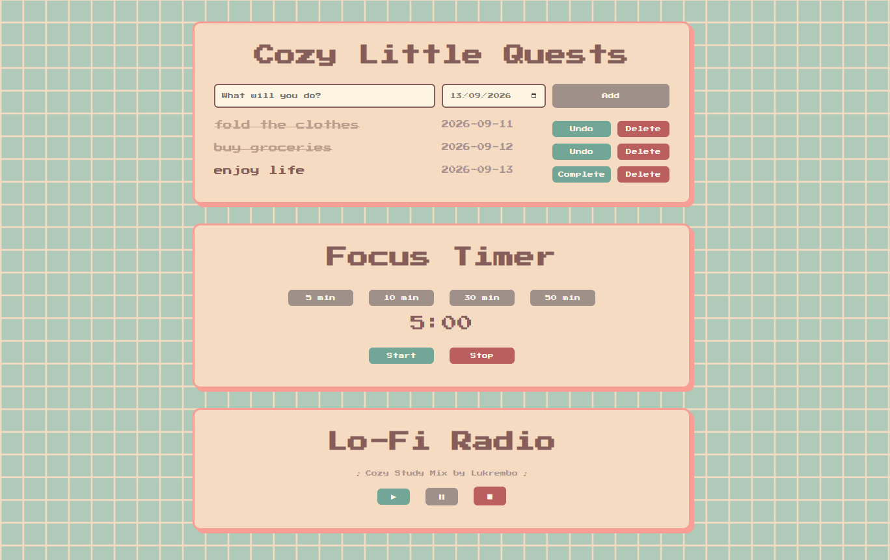
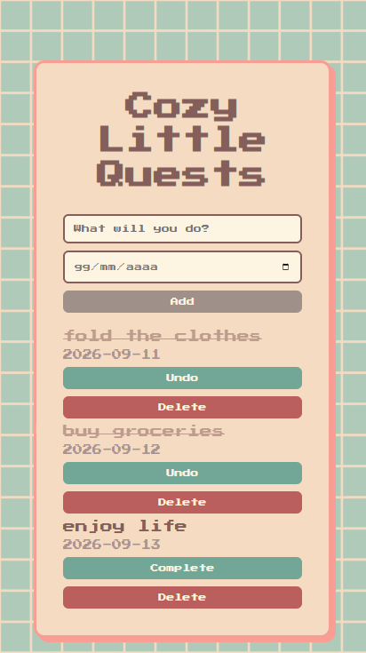
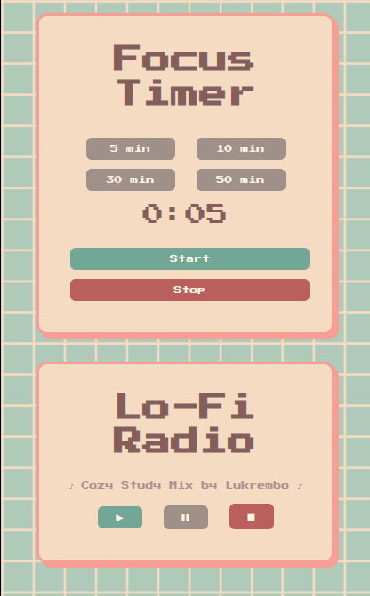

# Cozy Little Quests

A cozy and responsive to-do list web app designed to turn everyday tasks into small, manageable quests.

## Features

* Add new tasks
* Mark tasks as completed
* Delete tasks
* Persistent task data using `localStorage`
* Responsive layout
* Custom UI and visual design

## Technologies

* HTML5
* CSS3
* JavaScript
* Web Storage API (`localStorage`)

## Preview

### Desktop

### Mobile

## About the Project

Cozy Little Quests is a small frontend project created to practice JavaScript and build a complete interactive web interface from scratch.

The project focuses on DOM manipulation, event handling, data persistence and responsive UI development.

## Future Improvements

* Add task editing
* Add categories or tags
* Add additional customization options
* Improve accessibility
# cozy-little-quests
